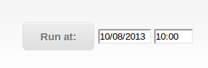

Creating Emulation via the Web UI
=================================
Here we explain how to use the web UI to create and manage emulations and view their results

Opening the UI
--------------

Provided that the API is running (see the *Starting components* section) The web UI will be accessible at

:: 

	http://[yourIP]:5050/index.html
	
The page is compatible with Chrome, Firefox or Safari web browsers
  
The page will automatically load in available emulators, distributions and resources.
It will detect which distributions and resources are compatible with the given emulator so that the user 
need not worry about creating XML the framework cannot process.

Any emulations which already exist will also be displayed in the right hand bar.

.. image:: webUIimages/Overall.png
	:scale: 50

Creating an emulation
---------------------

Each emulation requires a name and at least one distribution, as many distributions as required can be added.
Each distribution requires a name and all required fields to be filled, this data will vary as per the emulation, distribution or resource selected.

Distribution windows can be minimized for overall readability or removed entirely by clicking the 'x' in the top right corner

.. image:: webUIimages/MultiDist.png
	:scale: 75
	:align: right
	
	
Distribution Parameters
^^^^^^^^^^^^^^^^^^^^^^^

*Start time* determines how long (in seconds) after the overall emulation has begun, this particular distribution will begin.

*Duration* is how long the distribution will last for.

*Granularity* refers to the size of the steps taken from *startLoad* through to *stopLoad* over the course of the distributions run
For example a 60 second duration CPU stressing distribution with a granularity of 10 will move from *startLoad* to *stopLoad* in steps of 6%
	
More information on the emulator or distribution currently selected and the specific parameters they require can be viewed by hovering over the blue question mark beside it

.. image:: webUIimages/emulatorPopup.png
	:scale: 90

.. image:: webUIimages/DistPopup.png
	:scale: 90

Logging and Message Queue
^^^^^^^^^^^^^^^^^^^^^^^^^

After the distributions have been created and specified, there is an option to enable or disable logging.
Enabling logging give 2 more options, the *frequency* in seconds and the *level*, which dictates the amount of output the logs will contain

Below this is the option to enable or disable the message queue followed by various parameters allowing for it's setup

.. image:: webUIimages/logsandMQ.png
	:scale: 80
	
Running the emulation
^^^^^^^^^^^^^^^^^^^^^

Once all the parameters are set there are two options; run the emulation right away by clicking the *Run now* button,
or schedule the emulation to begin running at a set time in the future by clicking the *Run at* button

	
	
Working with existing emulations
--------------------------------

Any existing emulations in your system will be listed on the right hand side of the screen.
The UI also displays the total number of runs, how many of those failed and the current state of the emulation (*active* or *inactive*)

Hovering over the emulation name will display the information on that emulation in a popup and by clicking on it the emulation data
can be loaded into the creation screen on the left where its parameters can be edited or simply run again right away. 

Clicking the small download icon to the right of each emulation will prompt the download of a zip file to your system.
This zip file contains the .xml used to create the emulation as well as .csv files with the system logs and the logs for that specific emulation.

.. image:: webUIimages/emuDisplay.png
	:scale: 90

	

